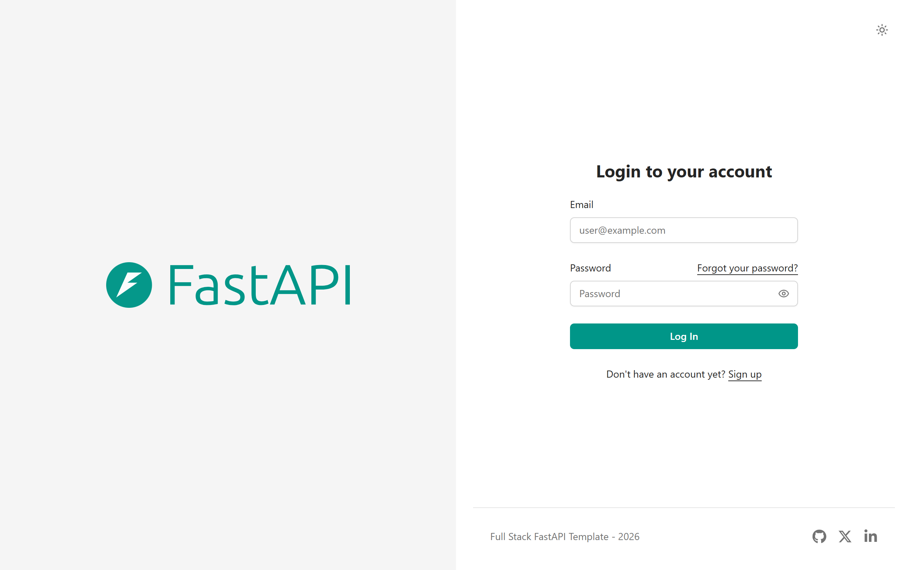
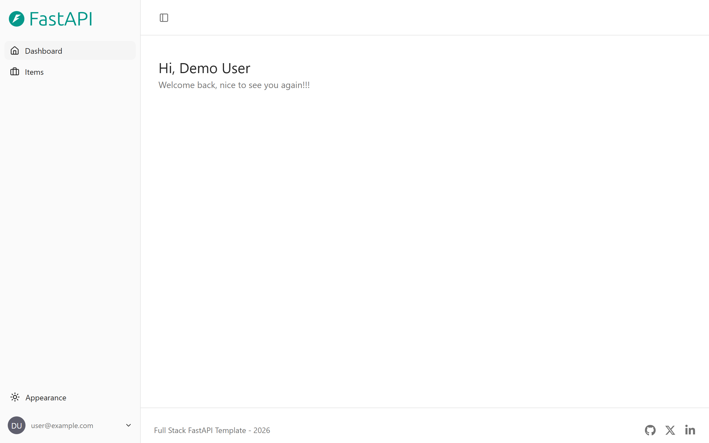
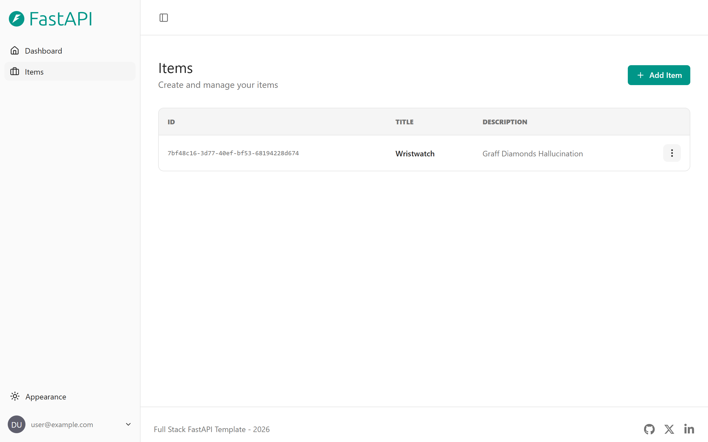
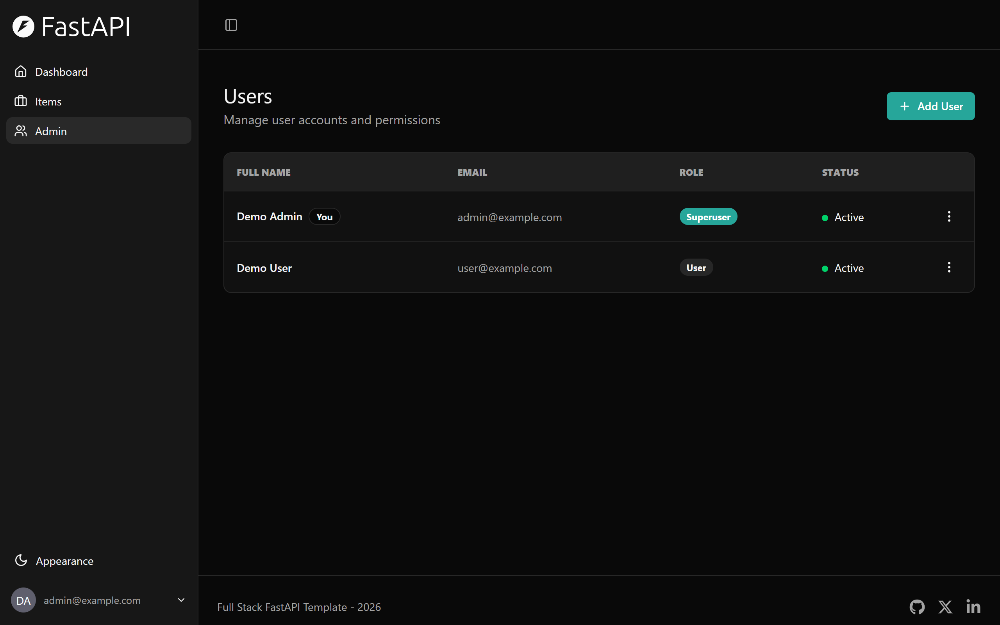
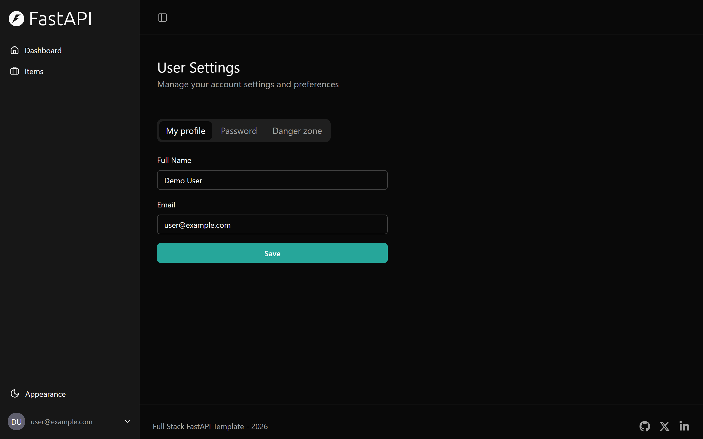
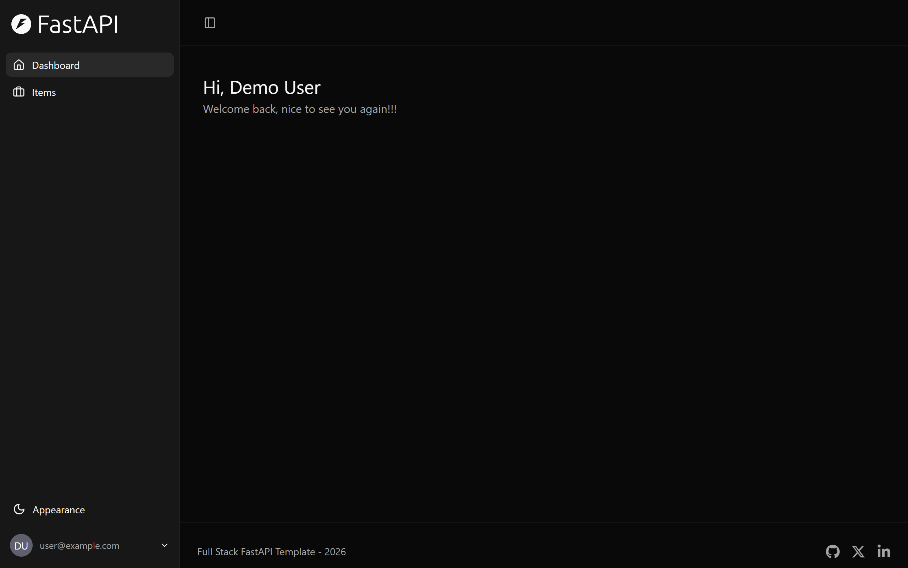
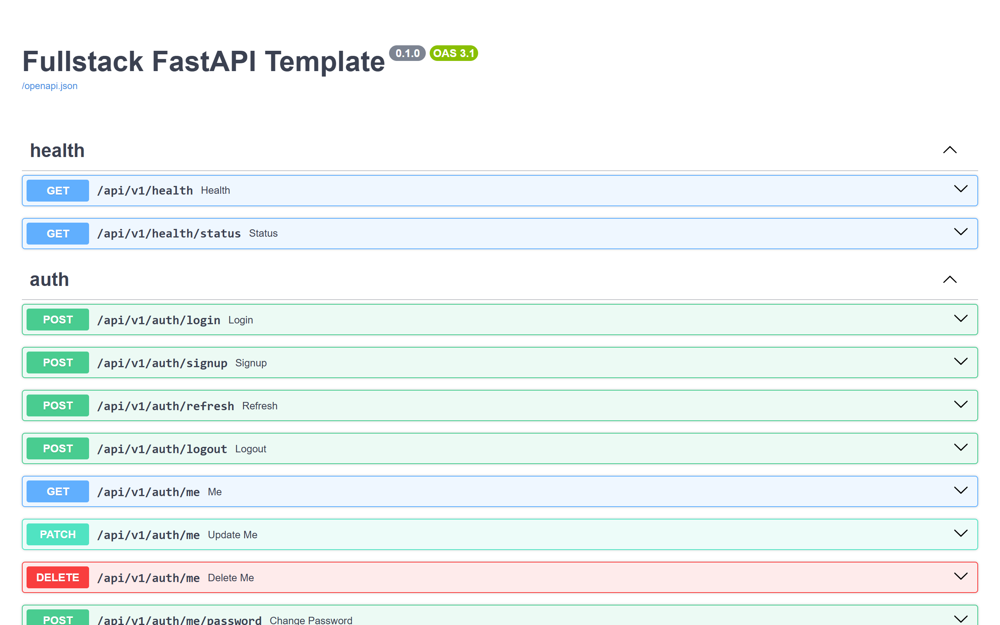

# Fullstack FastAPI Template

A public full stack FastAPI starter with app-owned auth, RBAC, React, Vite,
SQLModel, Alembic, optional Redis, password recovery, and frontend serving through
FastAPI's `app.frontend()`.

## Technology Stack and Features

- [FastAPI](https://fastapi.tiangolo.com) for the backend API.
  - SQLModel and Alembic for database models and migrations.
  - Cookie JWT sessions, CSRF protection, password hashing, and token revocation.
  - Role and permission based authorization for users, admins, and items.
  - Optional SMTP password recovery.
  - Optional Redis login rate limiting through `fastapi-redis-sdk` that never
    blocks core app flows.
- [React](https://react.dev) for the frontend.
  - TypeScript, Vite, TanStack Router, TanStack Query, and Tailwind CSS.
  - shadcn-style owned components and FastAPI template inspired UI.
  - Generated OpenAPI TypeScript client.
  - Playwright end-to-end tests.
  - Dark mode support.
- PostgreSQL for application data.
- Docker Compose for local dependency services only.
- Committed `dist/` output served by `app.frontend()`.

### Dashboard Login

<!-- Replace with a screenshot of this template. -->


### Dashboard

<!-- Replace with a screenshot of this template. -->


### Dashboard - Items

<!-- Replace with a screenshot of this template. -->


### Dashboard - Users

<!-- Replace with a screenshot of this template. -->


### User Settings

<!-- Replace with a screenshot of this template. -->


### Dashboard - Dark Mode

<!-- Replace with a screenshot of this template. -->


### Interactive API Documentation

<!-- Replace with a screenshot of this template. -->


## How To Use It

Use this project as a starting point for a new FastAPI full stack app.

### Option 1: GitHub Template

On GitHub, select **Use this template** and create a new repository from it. Then
clone your new repository locally.

With the GitHub CLI:

```bash
gh repo create my-fastapi-app --template mantle-bearer/fullstack-fastapi-template --clone
cd my-fastapi-app
```

Replace `mantle-bearer/fullstack-fastapi-template` with the published repository path.

### Option 2: degit

Use `degit` when you want a clean project directory without Git history:

```bash
npx degit mantle-bearer/fullstack-fastapi-template my-fastapi-app
cd my-fastapi-app
```

Use a tagged version for reproducible starts:

```bash
npx degit mantle-bearer/fullstack-fastapi-template#v0.1.0 my-fastapi-app
cd my-fastapi-app
```

### Option 3: Copier

Use Copier when you want prompted project settings:

```bash
uvx copier copy gh:mantle-bearer/fullstack-fastapi-template my-fastapi-app
cd my-fastapi-app
```

For a tagged version:

```bash
uvx copier copy gh:mantle-bearer/fullstack-fastapi-template --vcs-ref v0.1.0 my-fastapi-app
cd my-fastapi-app
```

### Option 4: Clone

Clone directly if you want this repository's Git history:

```bash
git clone https://github.com/mantle-bearer/fullstack-fastapi-template.git my-fastapi-app
cd my-fastapi-app
```

### Requirements

- Python 3.11+
- Node.js 20+
- Docker, for local Postgres and optional Redis
- [uv](https://docs.astral.sh/uv/)
- [pnpm](https://pnpm.io/)
- [just](https://just.systems/)

### Install Tools

macOS:

```bash
brew install python node pnpm just
curl -LsSf https://astral.sh/uv/install.sh | sh
```

Linux:

```bash
curl -LsSf https://astral.sh/uv/install.sh | sh
corepack enable
corepack prepare pnpm@latest --activate
```

Install Python, Node.js, Docker, and `just` with your distribution's package manager.

Windows PowerShell:

```powershell
winget install Python.Python.3.12
winget install OpenJS.NodeJS.LTS
winget install Docker.DockerDesktop
winget install Casey.Just
irm https://astral.sh/uv/install.ps1 | iex
corepack enable
corepack prepare pnpm@latest --activate
```

If `uv` is installed but not available as `uv` on Windows, use `python -m uv`
for the Python commands below.

### Configure

Copy the example environment file and update it for your project:

```bash
cp .env.example .env
```

On Windows PowerShell:

```powershell
Copy-Item .env.example .env
```

Before production, change at least:

- `DATABASE_URL`
- `JWT_SECRET`
- `ENVIRONMENT`
- `COOKIE_SECURE`
- `PUBLIC_BASE_URL`
- `CORS_ORIGINS`

Generate a secret key with:

```bash
python -c "import secrets; print(secrets.token_urlsafe(32))"
```

### Start The App

Start local dependency services:

```bash
docker compose up -d
```

Install dependencies and seed demo users:

```bash
uv sync --all-groups
pnpm --dir frontend install
uv run app seed-local
```

Run the FastAPI app:

```bash
uv run fastapi dev
```

Then open http://127.0.0.1:8000.

Demo users:

- `admin@example.com` / `ChangeMe123!`
- `user@example.com` / `ChangeMe123!`

For frontend-only development with Vite live reload:

```bash
pnpm --dir frontend dev
```

## Development

Common commands:

```bash
just test
just check
just build
pnpm --dir frontend test:e2e
```

Regenerate the OpenAPI client after backend API changes:

```bash
just client-generate
```

Backend docs: [backend/README.md](./backend/README.md).

Frontend docs: [frontend/README.md](./frontend/README.md).

Auth and RBAC docs: [docs/auth-rbac.md](./docs/auth-rbac.md).

Integrations docs: [docs/integrations.md](./docs/integrations.md).

Publishing checklist: [docs/publishing.md](./docs/publishing.md).

## Deployment

This app can deploy to FastAPI Cloud from the repository root:

```bash
uv run fastapi deploy
```

The committed `dist/` directory is intentional so the frontend can be served by
FastAPI through `app.frontend()` without a separate frontend build service.

PostgreSQL is required in production. SQLite is local-only and will be rejected
when `ENVIRONMENT=production`.

It is still a normal FastAPI app, so you can adapt it for other platforms that can
run Python and connect to PostgreSQL.

FastAPI Cloud checklist: [docs/fastapi-cloud.md](./docs/fastapi-cloud.md).

## Publishing Checklist

Before publishing your own template:

- Replace `mantle-bearer/fullstack-fastapi-template` placeholders.
- Confirm `.env` and `.fastapicloud/` are not tracked.
- Rebuild `dist/` with `just build`.
- Run `just check`, `just test`, and `just dist-check`.
- Confirm screenshots in `img/` match your app.
- Tag the first release, for example `v0.1.0`.

## Agent Workflow

Install current library skills:

```bash
uv tool run library-skills --all --yes
```

Run advisory skill checks:

```bash
just skills-check
```

Commit messages in this project must be at most 10 words.

## License

This template is licensed under the terms of the MIT license.
